 <!-- .element width="80%" -->

Note:

- 工作與開源社群混
- 神奇時刻
- 困難問題
- 久而久之，思考過程
- 也有可能是你自己

在工作與在開源社群混的這麼多年來，我經常在跟同事或朋友討論的時候遇到一些神奇的時刻，就是有些人總是可以提出一些很有趣的見解。比如說系統設計該怎麼作，困難的問題該怎麼突破等等。聽完他們的發言之後，經常會覺得，天那這也太博學多聞了，很多事情你之前就知道，但沒想過可以用在這樣一個情境裡面。

而提出這些意見的經常都是那幾個人，久而久之讓我自己很好奇，他們到底是怎麼樣的思考過程，才有辦法提出這麼精妙的見解？

很多時候，這個人也不是別人，或許就是這邊觀眾的其中一人。但是即使你就是那個可以提出精妙見解的人，很多時候你也不知道自己是怎麼得出那樣的結論的。

---

提出洞見的背後
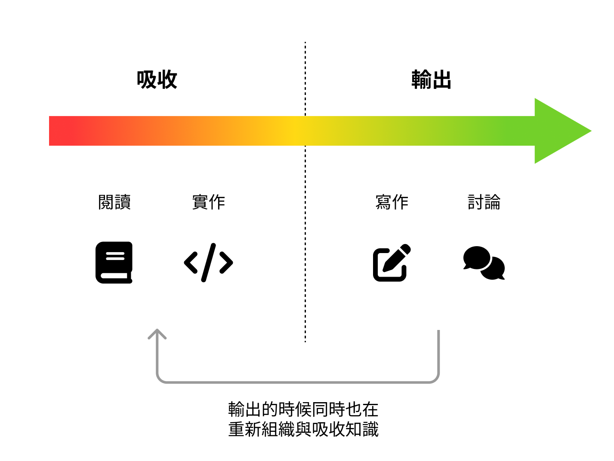 <!-- .element width="80%" -->

Note:

- 梳理凌亂的資訊
- 接著從腦袋裡面找出可能有用的資訊，並且看看是否有用
- 可以說他的腦袋的知識很多、聯想力很好

在講作筆記之前，我想要重新分析思考一下「提出洞見」這件事情的過程。那是我對這樣流程的一個解析，大家可以參考看看。

首先我覺得大家針對一個困難問題在討論的時候，其實就是很多凌亂的資訊散落一地，就像是沒整理好的積木一樣。擅長整理資訊的人，會透過來回的幾次問答，慢慢的把資訊分門別類的放好，讓問題本身變得容易理解。

梳理完「輸入的資訊」後，根據這些資訊，我們會在腦袋裡面去檢索我們已經累積的知識，試圖把這些已經存放的知識拿出來，嘗試著去跟手邊的積木拼在一起看看，看有沒有辦法拼出一組有可能的解法。

通常這樣的人他根據他過往累積足夠多的知識以及他對這些知識有優越的檢索能力 -- 也就是聯想能力很足夠。所以在知識量多，同時又有足夠的聯想能力可以找出有用知識的狀況下，就可以很快的找出適合現在這個脈絡的知識，拼在一起之後，就變成了那個我們覺得卓越的答案。

而這些資訊展示的時候因為已經得到適合的梳理，所以討論的大家都可以比較容易理解，也更容易取得大家的信任。

但是，這個聯想的過程到底是怎麼進行的呢？我們用一個例子來說明。

---

## 提出洞見

- 整理目前片面、凌亂的資訊
- 從已知的資訊之中，找出腦袋裡面可能相關的知識

---

舉例：講故事的時候要怎麼讓觀眾覺得精彩？

Note:

- 10 秒鐘

---

### 蒐集資訊

- 什麼形式？
- 故事的內容？
- 觀眾是誰？

---

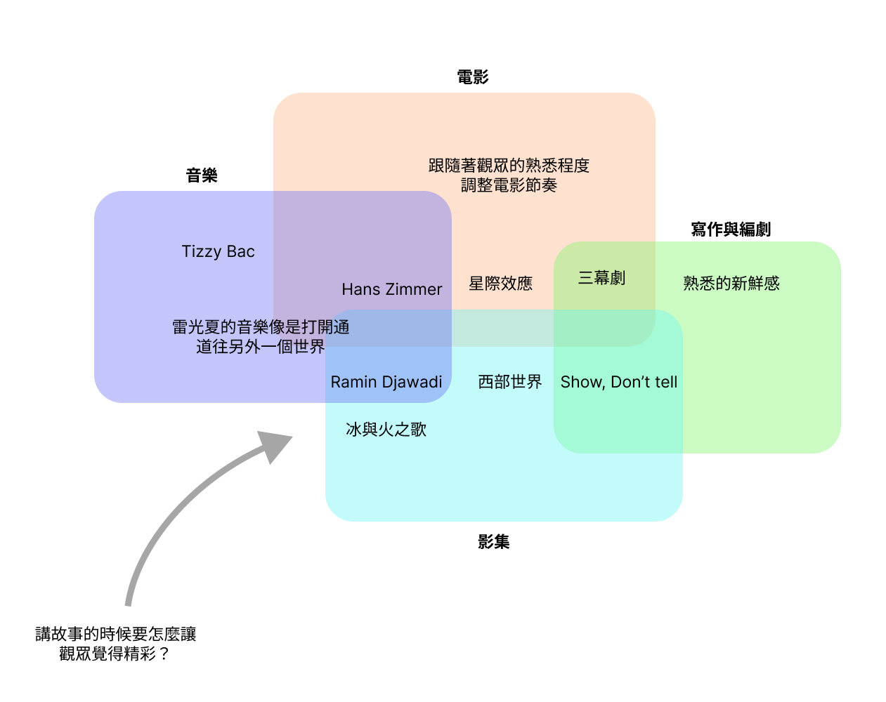 <!-- .element width="70%" -->

Note:

- 從寫作與編劇：三幕劇
- 從電影來看：星際效應，而且跟三幕劇相關（超立方）
- 從影集來看：西部世界是我非常喜歡的影集，而且他提到了 Show, Don't Tell
- 每個知識都有關聯性，把關聯性化成距離，攤在紙上，這些知識就像是地圖一樣
- 每個知識的分類都可能有點重疊，但是透過距離我們可以說一個知識跟兩個分類都有關係的，比如說 Show, Don't Tell 跟影集還有編劇都有關係

---

提出洞見跟作筆記的關係？

- **提出洞見**是一種聯想與思考過程
- **作筆記**也可以是一種聯想與思考過程

Note:

- 作筆記
- 但這不是深度思考的唯一方式
- 以前我還沒作筆記以前，透過閱讀、練習也是一樣可以做到，只是卡片盒筆記提供了一套比較有組織的方式來說

我想要先回頭討論一下我自己以前的學習方式。我以前的學習方式跟大家一樣，就是看書、看網路上的資訊、要使用新工具時先練習一段時間取得經驗。這裡面效率最好的就是練習，但是閱讀的話每次吸收的可能都不是很多，通常都需要隨著時間會慢慢的消化吸收，然後再每次實戰、練習遇到問題的時候，這些知識就會慢慢組織成我自己的形狀，最後比較有可能可以反芻並且應用上。但這樣的過程大多都是我會說他是有機的累積知識，但他就是慢慢的成長，但在每次閱讀時消化的資訊都很有限，也並沒有太多練習思考或是聯想的技巧。

所以我們這邊說的「作筆記」，其實他背後的目的是思考與聯想的練習，所以筆記其實是一個副產品，真正重要的產物是當你作筆記的時候，腦袋裡面產生的思考與聯想，讓一個知識在你的腦袋裡面有了安置與關聯的位置。

那具體來說要怎麼作呢？

---

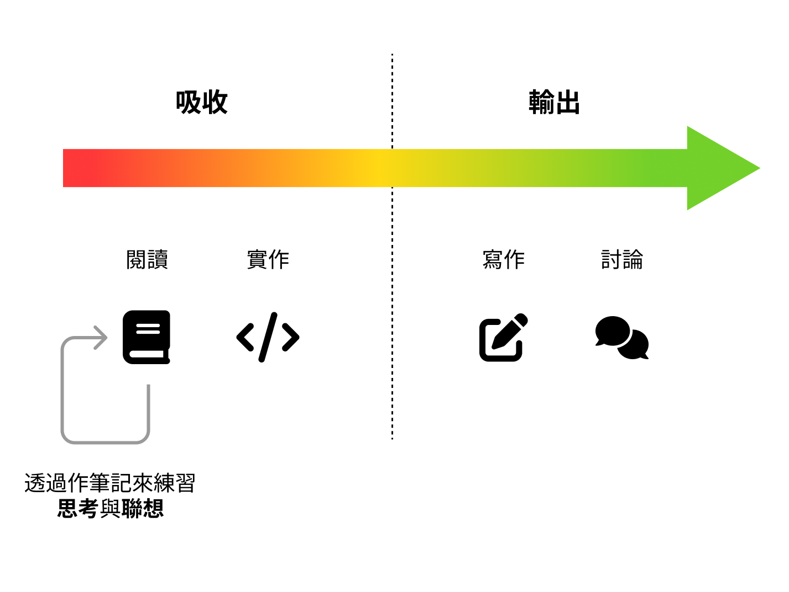 <!-- .element width="80%" -->

---

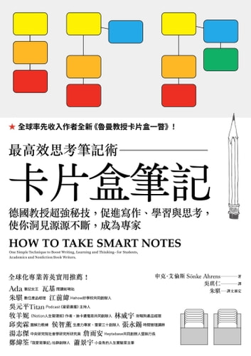

Note: 這邊要跟大家說一下，我作筆記的方法是基於一種叫做「卡片盒筆記法」的筆記方法，但是我已經調整了許多作法讓他更適合我自己的工作流程。我今天在這邊講的會是我自己的作法，而不完全是卡片盒比較法。如果大家對卡片盒筆記法有興趣，可以看一本書，名字就叫《卡片盒筆記法》。

---

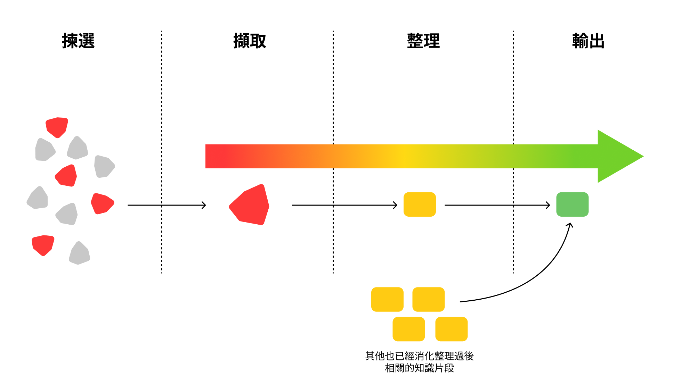

Note:

- 第一個步驟是挑選，這邊不會產生筆記，但後面三種都有各自的筆記。
- 今天主要要講的是前面三個步驟，「輸出」一般來講我是會寫成文章
- 或是像前面提到那種討論的時候提出意見，前面也大概講過了
- 然後二到四的步驟分別代表三個不同的脈絡，這個晚點會再講一下是什麼意思

---

揀選

Note: 在講蒐集之前，我想先跟大家快速講一下怎麼挑選要作筆記的知識，因為其實作筆記就需要花時間，而每個人的時間跟注意力都是有限的，所以我們會需要挑選要作筆記的資訊。我自己的建議是：

---

挑選「自己覺得有趣的事情」

Note: 比如說我自己看完一個我很喜歡的電影或是影集我也會作筆記，我看導演的採訪會作筆記，當然我學習知識的時候也會作筆記，比如說我最近在學習 nest.js 跟 W3C 的 Decentralized Identifiers，這些我都會作筆記。

---

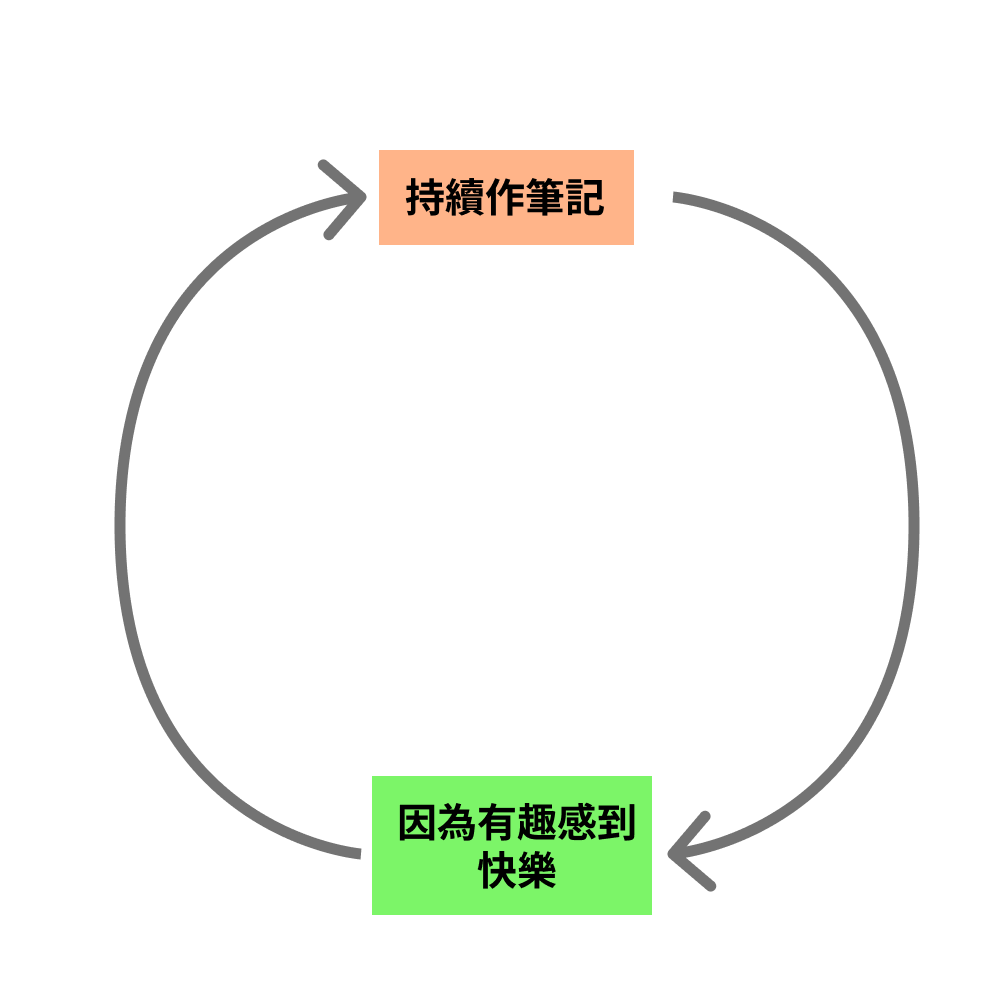 <!-- .element width="60%" -->

Note: 挑選「自己覺得有趣的事情」作筆記有幾個好處，第一個是作筆記會花費時間，如果作你覺得有興趣的事情，完成之後你會覺得有趣或是覺得滿足，這樣的正面情緒回饋會有點像是給你一個滿足感，讓你下次還會想要再做下一篇筆記。大家都知道養成習慣其實滿困難的，有了這樣正面的回饋之後，可以更容易的讓自己養成這個習慣。

但是你作這樣的筆記時，會發現這個範圍並不是只是在工作或是技術上，像是我可能會作一些跟情緒相關的筆記、一些電影的筆記等等，那為什麼需要這些筆記呢？主要的原因是你很難知道你讀的一些有趣的知識，什麼時候會派上用場。

---

 <!-- .element width="60%" -->

Note: Steve Jobs 我記得他在大學的時候沒有完成學業，但是他休學之後去聽了字型設計的課，而最後這些知識被他使用在 macOS 上面，這也是為什麼蘋果電腦的字型顯示總是比其他作業系統還要好的原因。

我想要說的是有時候你很難知道你學習的一個知識到底什麼時候會派上用場，他可能會在一個不經意的狀況幫助到你，所以我的建議是先對你覺得有趣的事情就可以作筆記了，讓他累積在你心理，就跟人生一樣，很難說什麼時候他會幫助到你。

---

擷取

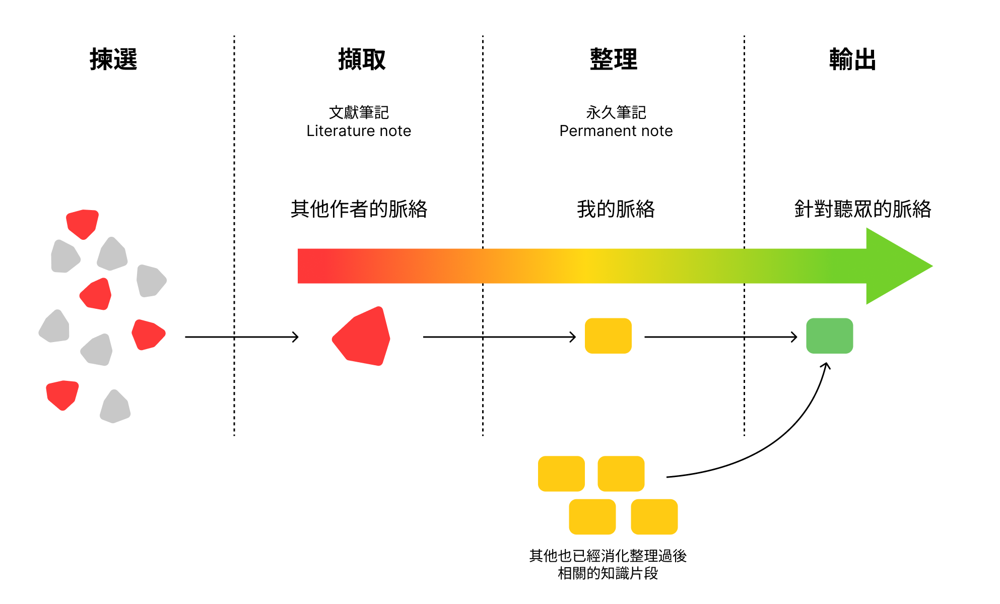

note: 蒐集是第一種筆記的類型，這些被蒐集的筆記稱為文獻筆記。不管是網站上的文章、電影、書籍跟 Youtube，我會記錄下我覺得有趣的知識。紀錄的形式會是我會先複製他的原文，然後下面再用自己的話重新轉寫一次。比如說最近我看了一個諾蘭的 Youtube 採訪，我對他裡面提到電影的節奏覺得很有興趣，我就這樣記錄下來：

---

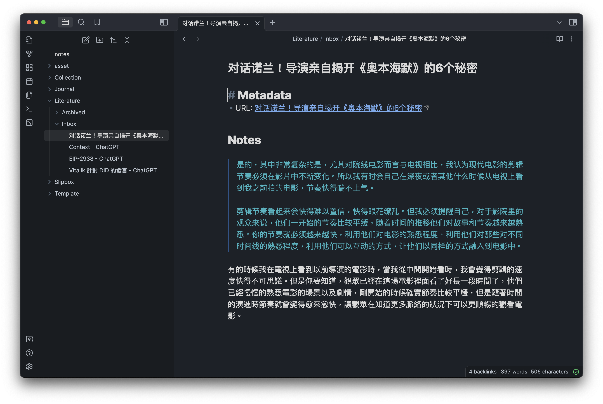 <!-- .element width="90%" -->

Note: 每篇筆記會有他的出處，而每個想要筆記下來的資訊都會用上面提到的形式筆記。原文跟我自己轉寫的文字一般來講文意是一樣的，但我可能會濃縮文字的內容，或是調整敘述的主體。

這樣轉寫的功能是讓自己在第一次筆記的時候作第一次初步的消化吸收。這個流程看起來很簡單，也只稍微多花一點時間，但是比起你直接複製貼上，這樣的流程確實可以讓你快速的先思考過一次。

---

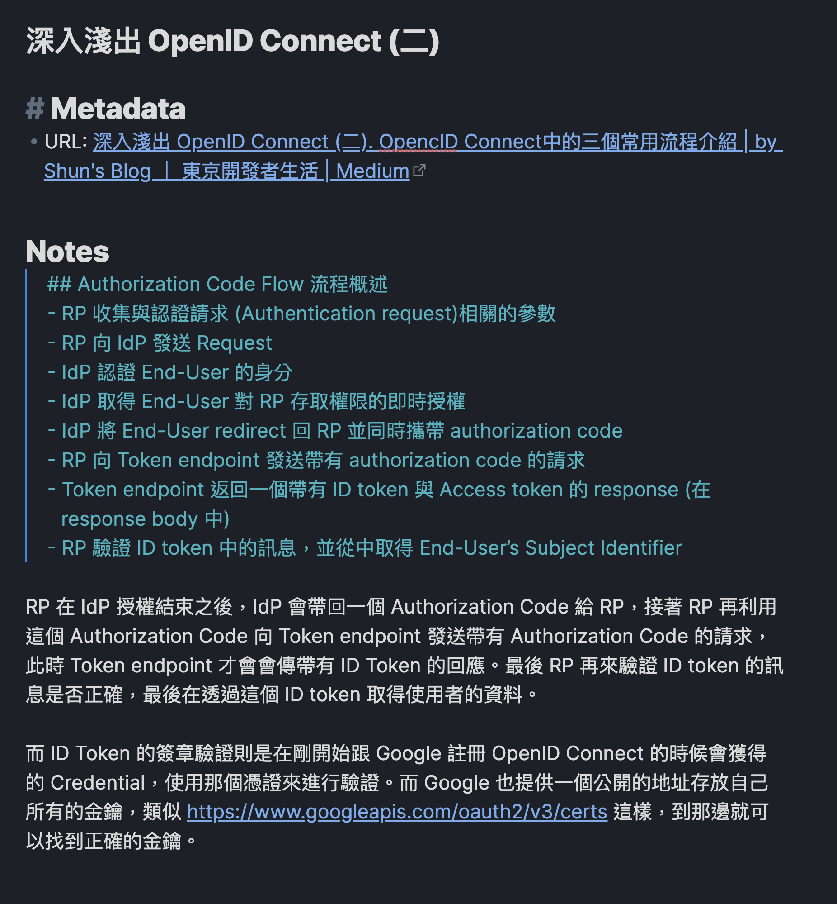 <!-- .element width="60%" -->

---

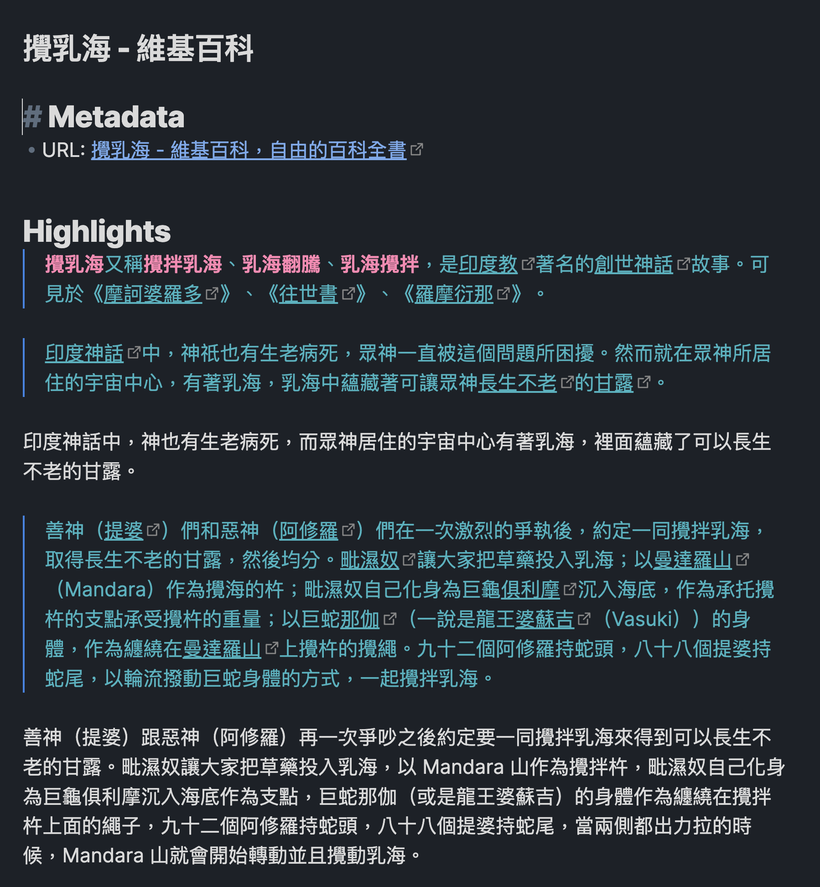 <!-- .element width="60%" -->

---

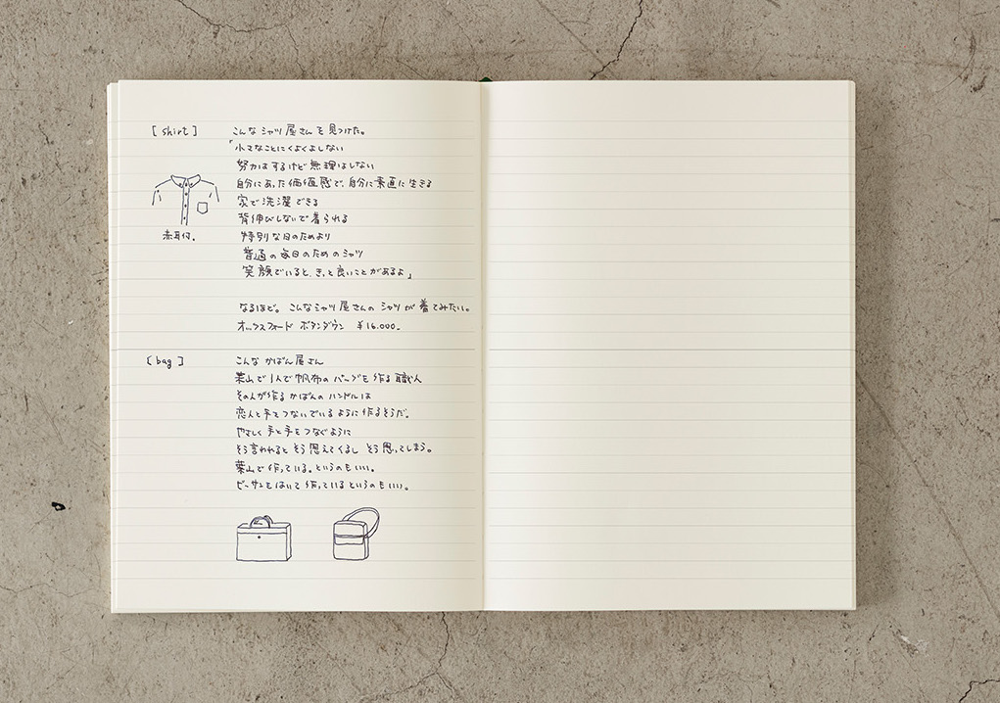 <!-- .element width="50%" -->

 [(image source link)](https://md.midori-japan.co.jp/en/products/mdnote/)

Note: 不知道以前大家唸書的時候會不會作用筆記本作筆記？我以前是不太作筆記的人。等到我有筆記型電腦之後，我很多時候會直接在投影片的備註欄直接快速的寫下老師上課講的所有內容。而有些同學他們會上課用紙筆作筆記。但我經常會覺得用紙筆作筆記的同學比起我要理解課堂上的知識要更深一點，但我一直都習慣用打字的方式紀錄，所以我都還是保持用打字的方式紀錄。

離開學校超過十年了，到現在我才想的比較清楚，為什麼當初那些同學學習的效果會比較好，這聽起來有點微妙，但我認為原因在於：用紙筆紀錄上課的內容，紀錄的效率比較差，由於紙筆這樣的工具紀錄效率比較不好，所以在上課的時候他們不得不濃縮老師講的資訊，轉換成另外一種比較短的形式騰寫下來。而在這樣謄寫的過程時，他們在筆記的時候就經過了一次的思考，畢竟轉寫的當下，他一定要對原本的資訊有一定程度的理解，才有辦法轉成另外一種形式的方式敘述。

這也跟為什麼我們在這邊不直接複製文字，而是複製文字以外還需要經過一次轉寫，因為我們希望在這次的轉寫過程當中，自己可以透過這樣轉寫的過程快速的重新思考一次，才把資訊記錄下來。這樣我們在蒐集的當下，就有一次快速的思考的練習機會。

---

整理

Note: 至於那些要整理的筆記，我會在 Slipbox 的目錄底下用一個新檔案來紀錄，這種筆記我們稱為永久筆記。

---

重新整理永久筆記的思考重點：

> 怎麼樣撰寫，下次只要單獨閱讀這篇筆記就可以理解？

Note: 當這些背景資訊都被紀錄之後就可以開始寫筆記本文了。在寫筆記本文的時候，我一般會考量到未來讀這篇筆記的時候，自己可以單獨看這篇筆記就可以理解這篇筆記的內容來撰寫，如果有需要先閱讀的資訊，也可以補充在前面。但主要就是考慮到單獨閱讀這篇就可以理解這篇筆記的資訊。

比起文獻筆記，原本紀錄的角度只是重新轉寫過後，但是還是擷取另外一篇文章裡面的重點部分。在永久筆記裡面，則是形成了一邊自己就可以獨立存在的筆記，而不是基於原本作者的脈絡來撰寫的。由於觀點的調整，除了這篇筆記已經變成一個獨立的存在，可以單獨閱讀了，腦袋裡面對同樣一件事情也會進行更深入的思考。

---

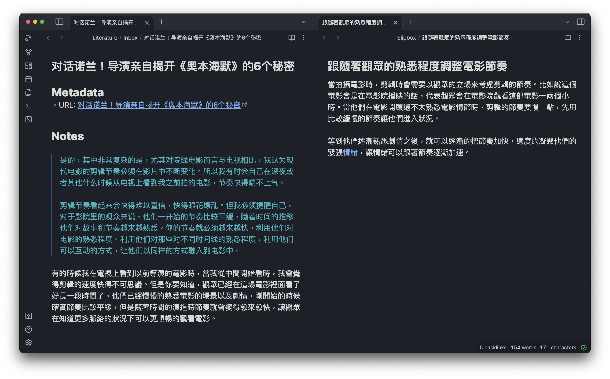

---

<video controls src="./assets/note-create-template.mp4"></video>

Note: 我開一個新檔案之後，會有一個特定的樣板講述作一個永久筆記要進行的所有工作。首先第一個工作是重新問自己覺得這篇筆記是否有趣？是否重要？如果不是的話，就不要紀錄。這邊的功能還是一樣，因為紀錄筆記是需要時間的，我們可以把時間花費到更重要或是有趣的筆記上面。

接下來我會先給他一些相關脈絡的資訊，比如他是從那篇文獻筆記整理來的，要紀錄的東西是否有簡寫或是英文，這些可以協助之後可以更方便的找到這篇筆記。

---

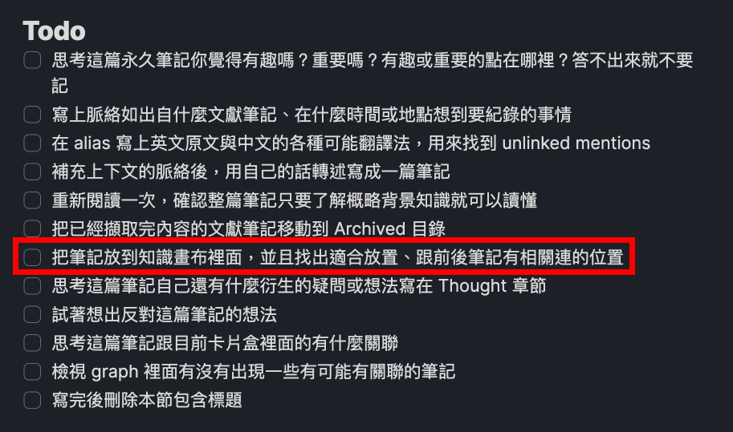

---

 <!-- .element width="70%" -->

---

<video controls src="./assets/whiteboard-canvas.mp4"></video>

---

## 跟其他分類方法相比的好處

- 跟聯想的思緒方式類似
- 可以快速 **掃視** 的視覺檢索
- 可以把距離當作關聯性來歸類筆記，不必然要有強制的分類
- 決定位置後，旁邊的筆記通常也是相關的

---

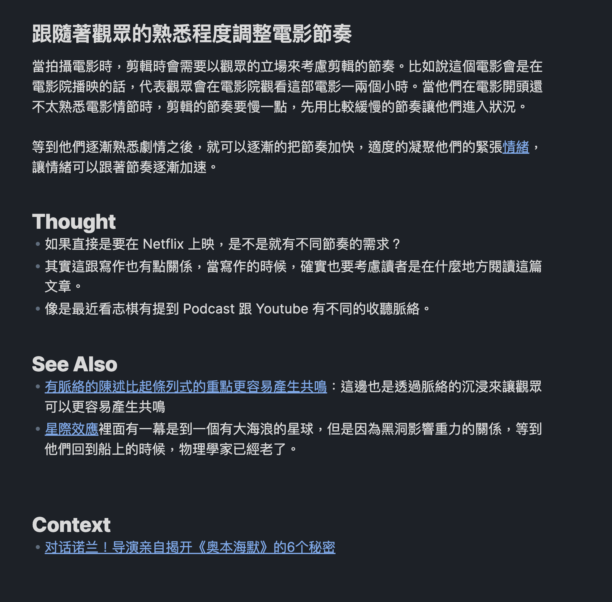 <!-- .element width="70%" -->

---

<video controls src="./assets/visually-discover-notes.mp4"></video>

---

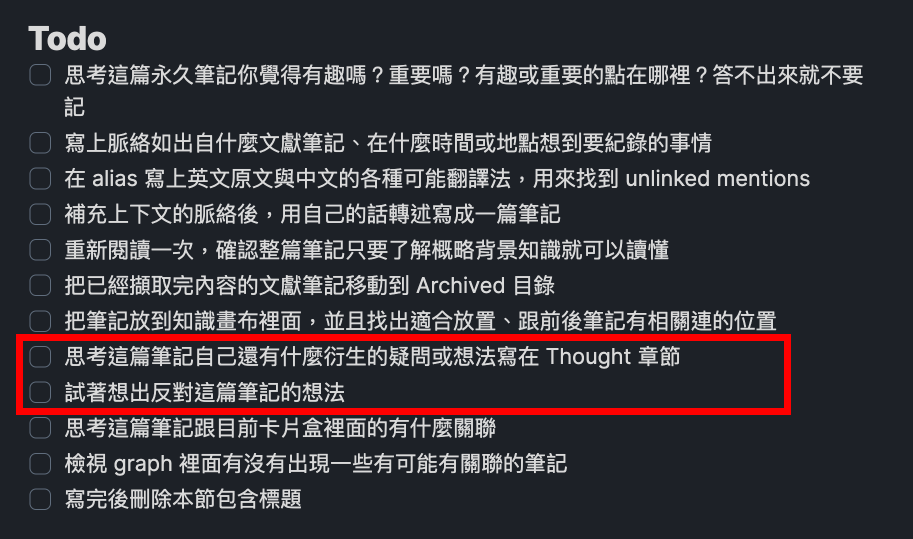

---

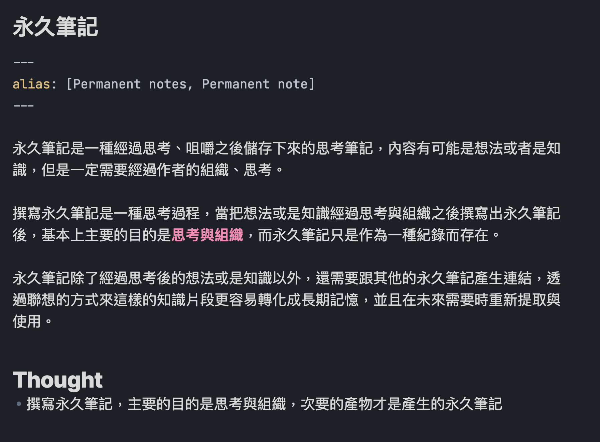

---

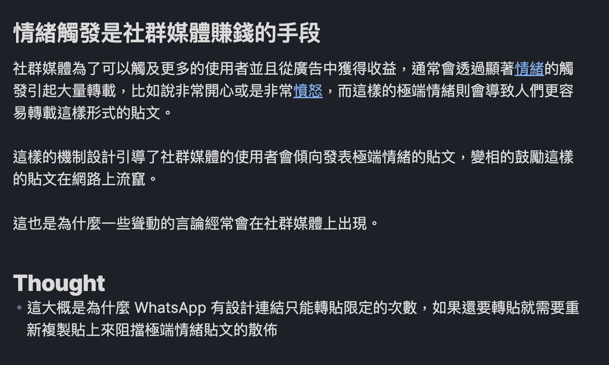

---

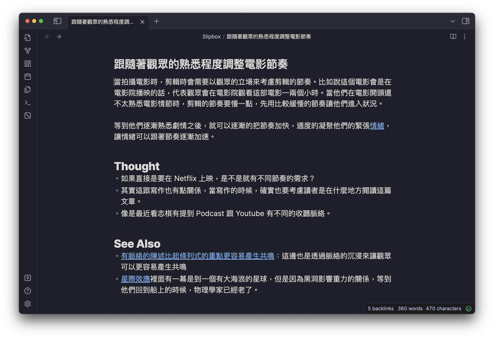

---

Local Graph - 另外一個角度的聯想

---

<video controls src="./assets/local-graph-to-right-panel.mp4"></video>

---

<video controls src="./assets/local-graph-depth-2.mp4"></video>

---

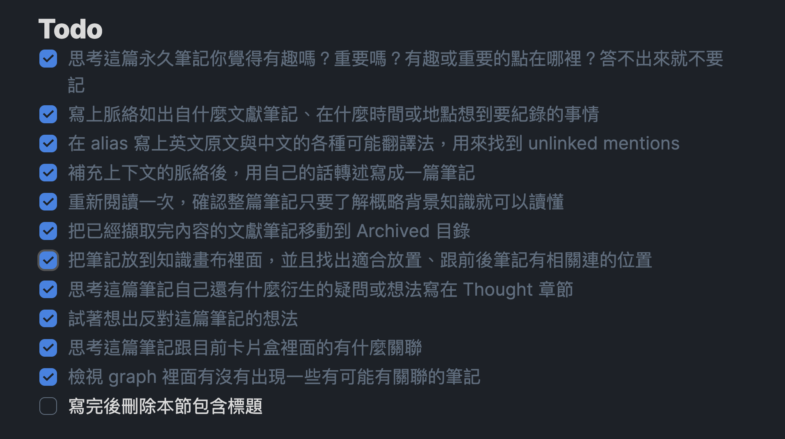

---

## 重點

- 深度思考與聯想把知識更牢固的錨定在記憶裡面
- 未來需要索引知識時，可以更快的找到相關資訊

---

自己執行「卡片盒筆記」的感想

Note: 這個時候我們對這個知識進行了比以往更深度的思考，同時也嘗試著在寫筆記的同時就為他找到了其他相關筆記的關聯性。這些我們作過的練習其實都會發揮作用，當一個新的知識如果跟這個知識有關的時候，會更容易的聯想到這篇筆記。

就我自己的經驗來說，我確實覺得這樣深度思考以及聯想練習之後，在跟其他人交談的時候確實更容易就可以想到相關聯的事情，確實讓我在知識探索這方面獲得了不少幫助。

但知識的累積與再利用並不是一朝一夕就可以完成的，這些經過深度思考以及聯想練習的知識雖然確實在我作筆記的當下確實很有成就感，但是帶領我持續保持這個習慣的最重要原因，還是我紀錄的是「我覺得有趣的事情」，因為這樣滿足感的驅動力，讓我每次記完筆記之後讓我很有成就感，而作下每一篇深度思考的筆記都要花費很多時間。

但是這樣的成就感帶著我持續的堅持這個習慣，等到意識到自己還是持續保持這個習慣時，已經過了一年了。

---

<video controls src="./assets/global-graph.mp4"></video>

Note: 過了一年後，我的筆記的關係圖長這樣，他就像是一個星雲一樣，每個知識筆記之間都互相有連結，而且真正讓我感到充足的，就是在自己提出了一些有趣觀點的時候。我經常跟我老婆聊很多各式各樣的話題，從技術、情緒、寫作到繪圖等等，我們還算滿常聊一些很虛無飄渺的東西，但是這樣對知識的探索真的是讓人感到滿足。我會在他畫畫的時候跟他討論透視感，喝咖啡的時候會跟他聊新的咖啡品種比如說像是 74112，當你有機會可以在聊天的時候並發出新的新想法的時候，這樣的時刻總是讓人很興奮有感激，

感激自己有持續這樣的習慣，拓展自己的視野。

然後呢？我成為了那個可以提出優秀意見的人了嗎？我自己是覺得或許沒有那麼大的差別，我會覺得自己原本就是喜歡在會議中整理大家的各種不同的觀點，最終嘗試整合大家意見的人。

所以真的有那麼神嗎？或許沒有吧。但是我還是可以感受到那些深入思考的知識在我心理發酵。就像是前面提到諾蘭採訪講的電影節奏，看完之後我又聯想到了電影劇本經常用的三幕劇，但到底什麼時候可以派上用場呢？

這次在準備這次的演講，又讓我反覆的想到演講也是一種形式的演出，所以最後我就用了三幕劇的方式來規劃這次演講，但當然第一次用也不太確定效果好不好。

但可以確定的時，我確實感受到那些在心理沈澱，深度思考之後慢慢發酵的知識，總是會在不經意的時刻跳出來幫我一把。

謝謝大家。

---

Thank you
